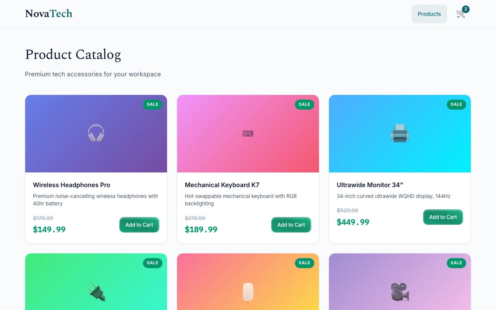
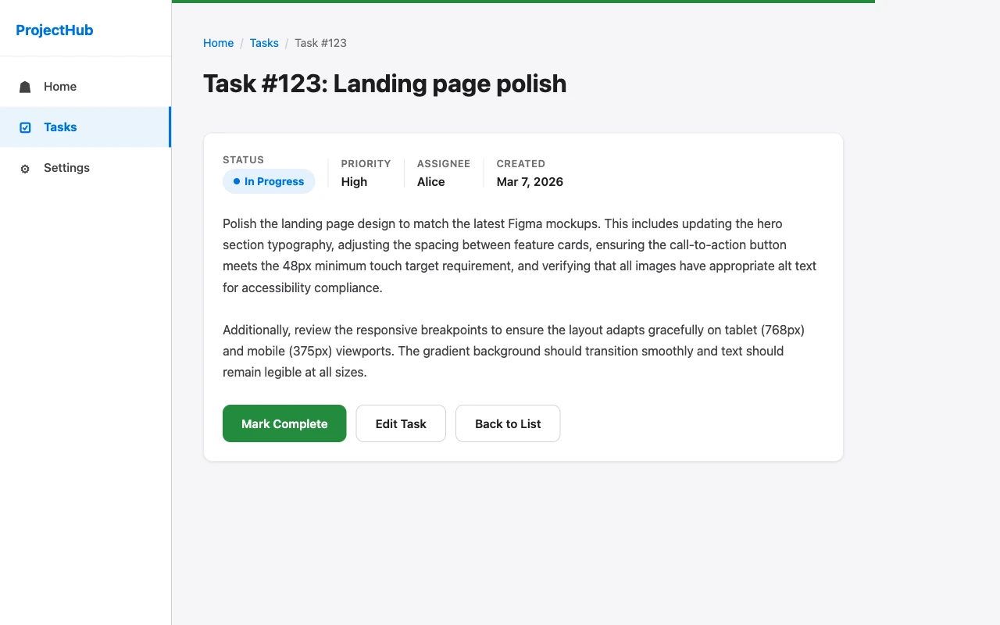
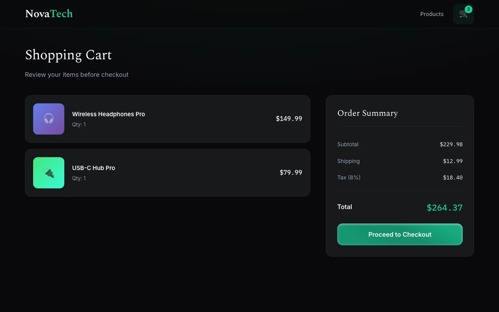
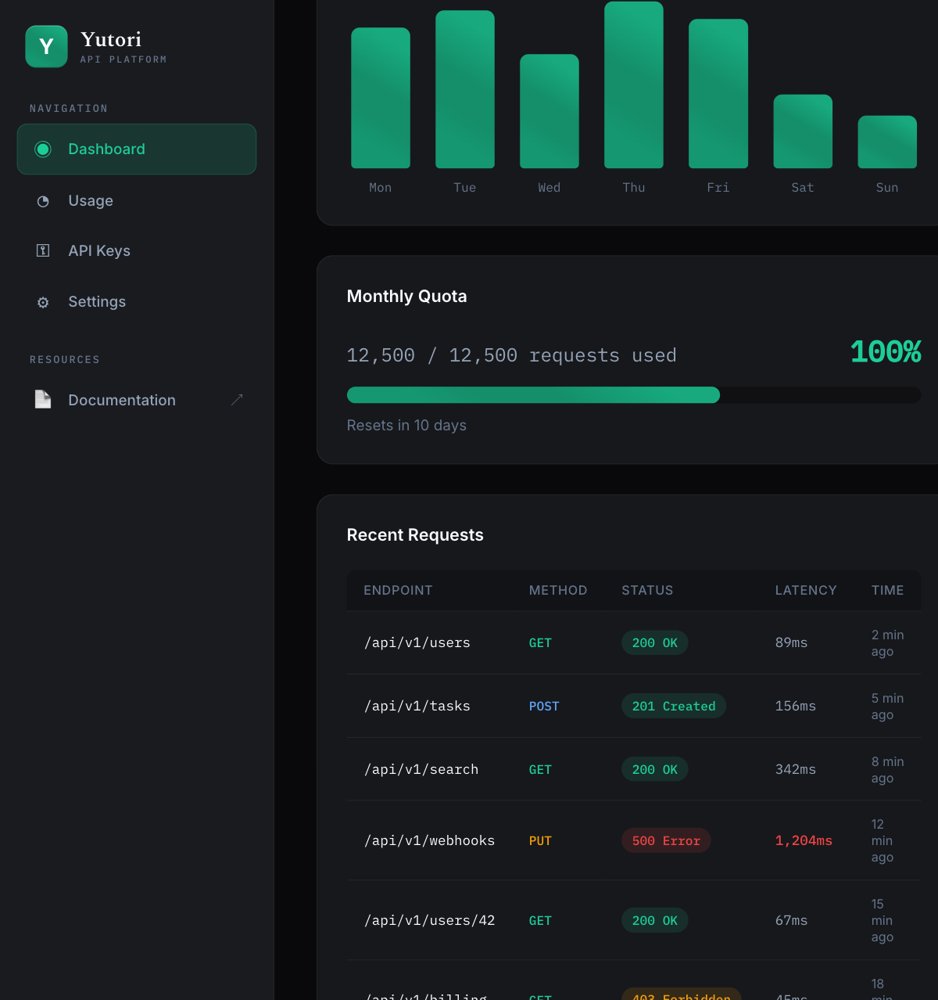

# frontend-visualqa

Gives coding agents eyes for frontend work — visual QA and verification powered by [Yutori n1](https://yutori.com/api).

## What it does

- Verifies explicit visual claims against a running localhost frontend
- Captures screenshots for quick visual inspection
- Reuses browser sessions across MCP tool calls for multi-step debugging
- Works as a CLI (`frontend-visualqa verify`), MCP server (`frontend-visualqa serve`), or agent skill (`/frontend-visualqa`)

Does not start your dev server. If the URL is unreachable, claims return `not_testable`.

## Why visualqa?

Playwright MCP can click, type, and assert against the DOM — but it cannot *see* the page. It can run cleanly on the wrong page, assert `modal.isVisible()` on a modal rendered off-screen, or miss a layout that broke on mobile.

n1 is a pixels-to-actions model trained with RL on live websites. Two capabilities matter here:

- **Self-correcting navigation** — Point the agent at the product catalog instead of a specific product page and n1 recognizes the wrong page, clicks through to the right one, and reports `trace.wrong_page_recovered: true`. Playwright MCP would run assertions on the wrong page and silently pass — garbage in, garbage out.

  <table border="0" cellspacing="0" cellpadding="8"><tr>
    <td align="center" width="47%"><br><em>n1 lands on the product catalog</em></td>
    <td align="center" width="6%"><strong>→</strong></td>
    <td align="center" width="47%"><br><em>Navigated to the correct product page</em></td>
  </tr></table>

- **Rich visual evaluation** — On the cart page, both items show sale prices ($149.99 and $79.99) but n1 caught that the subtotal of $279.98 was computed from the original prices — the discount was never actually applied to the total. On the API dashboard, the quota label reads "100%" but the progress bar is visibly only two-thirds full. Playwright MCP would pass both pages — the DOM text is internally consistent and the progress bar width is just a CSS value.

  <table border="0" cellspacing="0" cellpadding="8"><tr>
    <td align="center" width="50%"><br><em>n1 catches the discount-not-applied bug</em></td>
    <td align="center" width="50%"><br><em>Label says 100% but the bar tells a different story</em></td>
  </tr></table>

## Install

### Prerequisites

Install [uv](https://docs.astral.sh/uv/) if you don't already have it:

```bash
curl -LsSf https://astral.sh/uv/install.sh | sh
```

### Quick install (recommended)

1. Install CLIs:

    ```bash
    uv tool install frontend-visualqa \
      --with-executables-from yutori \
      --with-executables-from playwright
    playwright install chromium
    ```

    This installs the `frontend-visualqa`, `yutori`, and `playwright` CLIs and downloads the Chromium browser binary.

2. Log into Yutori API:

    ```bash
    yutori auth login
    ```

    This opens your browser to save your Yutori API key to `~/.yutori/config.json`.

    <details>
    <summary>Or, manually add your API key</summary>

    Go to [platform.yutori.com](https://platform.yutori.com) and add your key to the config file:
    ```bash
    mkdir -p ~/.yutori
    cat > ~/.yutori/config.json << 'EOF'
    {"api_key": "yt-your-api-key"}
    EOF
    ```
    </details>

3. Register the MCP server using [add-mcp](https://github.com/nicobailon/add-mcp) (works with all clients):

    ```bash
    npx add-mcp -g -n frontend-visualqa "frontend-visualqa serve"
    ```

    Pick the clients you want to configure.

4. Install workflow skills using [skills.sh](https://skills.sh):

    ```bash
    npx skills add yutori-ai/frontend-visualqa -g
    ```

    Adds the `/frontend-visualqa` slash command for claim-based visual QA guidance.

    `-g` installs at user scope. Omit `-g` for project-local install.

5. Restart the agent client.

   <details>
   <summary>To uninstall later:</summary>

   ```bash
   uv tool uninstall frontend-visualqa
   npx skills remove -g frontend-visualqa
   ```

   `add-mcp` has no remove command. Delete the `frontend-visualqa` entry from your client's MCP config (e.g. `~/.mcp.json`).
   </details>

### Manual per-client setup

<details>
<summary><strong>Claude Code</strong></summary>

**Plugin (recommended)** — installs MCP tools + skill together:

```
/plugin marketplace add yutori-ai/frontend-visualqa
/plugin install frontend-visualqa@frontend-visualqa-plugins
```

**MCP only** (if you prefer not to use the plugin):

```bash
claude mcp add --scope user frontend-visualqa -- frontend-visualqa serve
```

</details>

<details>
<summary><strong>Codex</strong></summary>

```bash
codex mcp add frontend-visualqa -- frontend-visualqa serve
```

Skills can be installed via `npx skills add` above, or with `$skill-installer` inside Codex:

```
$skill-installer install https://github.com/yutori-ai/frontend-visualqa/tree/main/.agents/skills/frontend-visualqa
```

</details>

<details>
<summary><strong>Cursor / VS Code / other MCP hosts</strong></summary>

Use the checked-in `.mcp.json`, or point your client at `frontend-visualqa serve`.

</details>

<details>
<summary><strong>From source</strong></summary>

```bash
uv sync
uv run playwright install chromium
```

Register the MCP server with your client using `uvx --from /absolute/path/to/frontend-visualqa frontend-visualqa serve` as the command.

</details>

### Uninstall

<details>
<summary><strong>Claude Code plugin</strong></summary>

```
/plugin uninstall frontend-visualqa@frontend-visualqa-plugins -s user
```

</details>

<details>
<summary><strong>Codex</strong></summary>

Remove the MCP server entry from `~/.codex/config.toml`, then delete the skill directory:

```bash
rm -rf ~/.agents/skills/frontend-visualqa
```

Restart Codex after removing.

</details>

## Quick start

The repo includes demo pages you can use immediately — no dev server required:

```bash
# From the repo root, serve the included demo pages
cd /path/to/frontend-visualqa
lsof -ti:8000 | xargs kill 2>/dev/null; python3 -m http.server 8000 -d examples &
```

**Self-correcting navigation** — start on the wrong page and watch n1 find its way. In headed mode, you'll see click ripples, scroll indicators, and a status chip showing what n1 is doing:

```bash
# n1 lands on the product catalog, clicks through to find the product detail page
# Green click ripples and a status HUD show each action as it happens
frontend-visualqa verify http://localhost:8000/ecommerce_store.html \
  --headed \
  --claims "The product detail page shows 'Wireless Headphones Pro' priced at $149.99"
```

**Catching regressions** — mix passing and failing claims:

```bash
frontend-visualqa verify http://localhost:8000/analytics_dashboard.html \
  --headed \
  --claims \
  "The API status indicator shows Active" \
  "The monthly quota progress bar is completely filled"
# → first claim passes, second fails (label says 100% but bar is ~65% full)
```

**Catching pricing bugs** — verify that discounts are actually applied:

```bash
frontend-visualqa verify http://localhost:8000/ecommerce_store.html#/cart \
  --headed \
  --claims "The cart subtotal reflects the discounted prices shown on each item"
# → fails: items show sale prices but subtotal uses the original prices
```

Use against your own frontend the same way — just swap the URL:

```bash
frontend-visualqa screenshot http://localhost:3000
frontend-visualqa verify http://localhost:3000/dashboard \
  --claims "The revenue chart is visible without scrolling"
```

## MCP tools

| Tool | Description |
|------|-------------|
| `verify_visual_claims` | Structured pass/fail visual checks with screenshot evidence |
| `take_screenshot` | Capture current page state |
| `manage_browser` | Inspect, reset, close, or resize the shared browser session |

### Recommended agent workflow

1. Ensure the local frontend is running
2. `take_screenshot` to confirm page state
3. Write 1–5 concrete visual claims
4. `verify_visual_claims`
5. Fix code, rerun claims until they pass

## CLI reference

```
frontend-visualqa <command> [options]
```

| Command | Description |
|---------|-------------|
| `verify` | Verify visual claims against a URL |
| `screenshot` | Capture a screenshot |
| `login` | Open a headed browser to log in and save the session |
| `serve` | Start the MCP stdio server |
| `status` | Show browser status as JSON |

<details>
<summary><strong>verify options</strong></summary>

```bash
frontend-visualqa verify <url> --claims "claim1" "claim2" [options]
```

| Flag | Default | Description |
|------|---------|-------------|
| `--claims` | *(required)* | One or more visual claims |
| `--navigation-hint` | | Interaction guidance before judging |
| `--width` / `--height` | 1280 / 800 | Viewport size |
| `--device-scale-factor` | 1.0 | DPR |
| `--headed` | off | Show the browser (implies `--visualize`) |
| `--visualize` / `--no-visualize` | on when headed | Show in-browser action overlay (click ripples, scroll indicators, status chip) |
| `--browser-mode` | ephemeral | `ephemeral` or `persistent` |
| `--user-data-dir` | | Custom profile directory |
| `--session-key` | default | Named browser session |
| `--max-steps-per-claim` | 12 | Max actions per claim |
| `--claim-timeout-seconds` | 120 | Per-claim timeout |
| `--run-timeout-seconds` | 300 | Whole-run timeout |
| `--reporter` | native | Output reporter (`native`, `ctrf`). Repeat for multiple. |

</details>

<details>
<summary><strong>More examples</strong></summary>

Navigation hint for claims that require interaction:

```bash
frontend-visualqa verify http://localhost:8000/ecommerce_store.html \
  --claims "The cart badge shows 3 items" \
  --navigation-hint "Click 'Add to Cart' on the Mechanical Keyboard K7 product card."
```

Scrolling to find off-screen content:

```bash
frontend-visualqa verify http://localhost:8000/analytics_dashboard.html \
  --claims "The /api/v1/webhooks endpoint returned a 200 OK status"
# → fails: n1 scrolls to the request table and finds a 500 Error
```

</details>

## Browser modes

| Mode | Flag | Cookies persist? | Use case |
|------|------|-----------------|----------|
| Ephemeral *(default)* | — | No | Public pages, CI |
| Persistent | `--browser-mode persistent` | Yes | Auth-gated local dev |

<details>
<summary><strong>Persistent profile setup</strong></summary>

Log in once, reuse for all future runs:

```bash
# 1. One-time login — opens a headed browser, log in, press Enter to save
frontend-visualqa login http://localhost:3000/login

# 2. Subsequent runs reuse the saved session
frontend-visualqa verify http://localhost:3000/dashboard \
  --browser-mode persistent \
  --claims "The user avatar is visible in the header"
```

Profile stored at `~/.cache/frontend-visualqa/browser-profile/` by default. Override with `--user-data-dir`:

```bash
frontend-visualqa login http://localhost:3000/login \
  --user-data-dir /tmp/my-project-profile

frontend-visualqa verify http://localhost:3000/dashboard \
  --browser-mode persistent \
  --user-data-dir /tmp/my-project-profile \
  --claims "The dashboard loads without a login redirect"
```

</details>

## Action visualization

When running in headed mode (`--headed`), the browser shows visual effects illustrating what n1 is doing (clicking, scrolling, typing). To disable it, use `--no-visualize`:

```bash
frontend-visualqa verify http://localhost:3000 \
  --headed --no-visualize \
  --claims "The API status indicator shows Active"
```

The MCP tool `verify_visual_claims` accepts a per-call `visualize` parameter to control this independently of the server's default.

Overlay elements are automatically hidden during screenshot capture so they never appear in evidence sent to n1 or saved artifacts.

## Writing good claims

Claims should be observable, scoped, and provable from pixels.

| Good | Weak |
|------|------|
| The cart total is $261.37 | The cart works correctly |
| The product price shows $149.99 in monospace font | The page looks polished |
| At 375px width, the stat cards stack in a single column | The dashboard is responsive |

If a claim requires interaction first, use `--navigation-hint` instead of encoding steps in the claim text.

## Result statuses

| Status | Meaning |
|--------|---------|
| `passed` | Claim matched the visual evidence |
| `failed` | Claim was visually false |
| `inconclusive` | Runner explored but couldn't determine confidently |
| `not_testable` | Environment blocked verification (server down, auth wall) |

## Reporters

Output format for persisted artifacts. Does not affect CLI stdout or MCP tool responses (always native JSON).

| Reporter | File | Description |
|----------|------|-------------|
| `native` *(default)* | `run_result.json` | Full domain-specific schema with all fields |
| `ctrf` | `ctrf-report.json` | [CTRF](https://ctrf.io/) standard JSON for CI/CD integration |

Each claim result contains:
- **`finding`** — the verdict explanation (what was observed)
- **`proof`** — the decisive artifact paths, step number, and a compact extracted-text preview
- **`page`** — URL and viewport where the claim was evaluated
- **`trace`** — the execution trace: actions taken, screenshot paths, and the saved trace path

<details>
<summary><strong>Example claim result</strong></summary>

```json
{
  "claim": "The monthly quota progress bar is completely filled",
  "status": "failed",
  "finding": "The quota label reads '100%' and '12,500 / 12,500 requests used', but the progress bar is visually only about 65% filled — the bar and the label disagree.",
  "proof": {
    "screenshot_path": "artifacts/run-.../claim-02/step-04.webp",
    "step": 4,
    "after_action": "extract_elements()",
    "text": "Monthly Quota\n12,500 / 12,500 requests used  100%\n...",
    "text_path": "artifacts/run-.../claim-02/step-04.txt"
  },
  "page": {
    "url": "http://localhost:8000/analytics_dashboard.html",
    "viewport": { "width": 1280, "height": 800, "device_scale_factor": 1.0 }
  },
  "trace": {
    "steps_taken": 4,
    "wrong_page_recovered": false,
    "screenshot_paths": ["..."],
    "actions": ["..."],
    "trace_path": "artifacts/run-.../claim-02/action_trace.json"
  }
}
```

`proof.screenshot_path` points to the screenshot n1 was examining when it rendered the verdict.
`proof.text` is intentionally compact for token efficiency; if `proof.text_path` is present, open that file for the full extracted DOM/content readout.
`trace.trace_path` remains action-only, so large text payloads do not bloat the action trace.

</details>

```bash
frontend-visualqa verify http://localhost:3000 \
  --claims "The checkout total matches the sum of line items" \
  --reporter native --reporter ctrf
```

## Development

```bash
uv sync
uv run playwright install chromium
uv run frontend-visualqa --help
```

Editable install:

```bash
uv pip install -e .
```

## Skill packaging

The canonical skill lives in [skills/frontend-visualqa/SKILL.md](skills/frontend-visualqa/SKILL.md).

- `skills/frontend-visualqa/` is the source of truth.
- `.agents/skills/frontend-visualqa/` is a compatibility wrapper for Codex and other OpenAI-compatible installers.
- `.claude-plugin/` and `.cursor-plugin/` contain plugin marketplace manifests.
- `docs/skill-ecosystem.md` records the packaging rationale.
